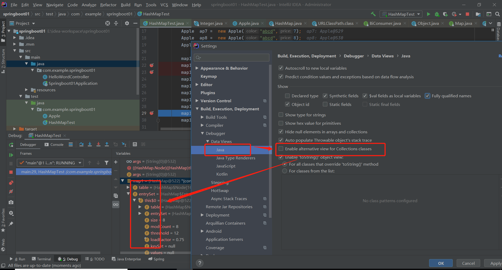

### HashMap
[TOC]
#### hash算法

* 散列函数
* 冲突解决策略
* 


#### HashMap底层数据结构?
##### 一些重要的参数

* **table** : 
* **load Factor:  加载因子**
* **capacity: 总容量** 
* **size : 实际存储的元素数量**
* **threshold: 扩容阈值**
```
threshold = capacity * load factor
```
当 size > threshold 执行扩容操作。


#### put操作

```java
    public V put(K key, V value) {
        // 对key取hash值
        return putVal(hash(key), key, value, false, true);
    }

    final V putVal(int hash, K key, V value, boolean onlyIfAbsent,
                   boolean evict) {
        Node<K,V>[] tab; Node<K,V> p; int n, i;
        //table 为空则创建
        if ((tab = table) == null || (n = tab.length) == 0)
            n = (tab = resize()).length;
        //计算index,空值处理
        if ((p = tab[i = (n - 1) & hash]) == null)
            tab[i] = newNode(hash, key, value, null);
        else {
            Node<K,V> e; K k;
            // 节点存在,hash相同，比较key
            if (p.hash == hash &&
                ((k = p.key) == key || (key != null && key.equals(k)))) // 基本类型比较或对象比较
                e = p;
            // 树节点
            else if (p instanceof TreeNode)
                e = ((TreeNode<K,V>)p).putTreeVal(this, tab, hash, key, value);
            else { // 链表节点
                for (int binCount = 0; ; ++binCount) {
                    if ((e = p.next) == null) { // 链表最后一个节点
                        p.next = newNode(hash, key, value, null);
                        // 链表长度大于TREEIFY_THRESHOLD,将链表结构转为树结构 （树化）
                        if (binCount >= TREEIFY_THRESHOLD - 1) // -1 for 1st
                            treeifyBin(tab, hash);
                        break;
                    }
                    // 判断是否已存在key值相同的节点
                    if (e.hash == hash &&
                        ((k = e.key) == key || (key != null && key.equals(k))))
                        break;
                    //不存在，继续寻找
                    p = e;
                }
            }
            
            if (e != null) { // existing mapping for key
                V oldValue = e.value;
                if (!onlyIfAbsent || oldValue == null)
                    e.value = value; //替换原有节点的值
                afterNodeAccess(e);
                return oldValue; // 返回旧节点的值
            }
        }
        ++modCount;
        // 判断是否需要进行扩容操作
        if (++size > threshold)
            resize();
        afterNodeInsertion(evict);
        return null;
    }
    
```

#### get操作

```java
    
    public V get(Object key) {
        Node<K,V> e;
        return (e = getNode(hash(key), key)) == null ? null : e.value;
    }

    final Node<K,V> getNode(int hash, Object key) {
        Node<K,V>[] tab; Node<K,V> first, e; int n; K k;
        if ((tab = table) != null && (n = tab.length) > 0 &&
            (first = tab[(n - 1) & hash]) != null) {
            // 直接命中
            if (first.hash == hash && // always check first node
                ((k = first.key) == key || (key != null && key.equals(k))))
                return first;
            // 未命中
            if ((e = first.next) != null) {
                // 遍历树
                if (first instanceof TreeNode) 
                    return ((TreeNode<K,V>)first).getTreeNode(hash, key);
                // 遍历链表
                do {
                    if (e.hash == hash && 
                        ((k = e.key) == key || (key != null && key.equals(k))))
                        return e;
                } while ((e = e.next) != null);
            }
        }
     
        return null;
    }
    
```


#### remove操作，没有resize操作？why

```java
final Node<K,V> removeNode(int hash, Object key, Object value,
                               boolean matchValue, boolean movable) {
        Node<K,V>[] tab; Node<K,V> p; int n, index;
        if ((tab = table) != null 
            && (n = tab.length) > 0 &&
            (p = tab[index = (n - 1) & hash]) != null) { //  (n - 1) & hash 防止数据越界
           
            Node<K,V> node = null, e; K k; V v;
            if (p.hash == hash &&
                ((k = p.key) == key || (key != null && key.equals(k))))
                node = p; // 桶节点
            else if ((e = p.next) != null) { 
                if (p instanceof TreeNode) // 红黑树
                    node = ((TreeNode<K,V>)p).getTreeNode(hash, key);
                else { // 链表
                    do {
                        if (e.hash == hash &&
                            ((k = e.key) == key ||
                             (key != null && key.equals(k)))) {
                            node = e;
                            break;
                        }
                        p = e;
                    } while ((e = e.next) != null);
                }
            }
            // 找到节点之后，按照节点类型，删除元素。 （对象引用操作）
            if (node != null && (!matchValue || (v = node.value) == value ||
                                 (value != null && value.equals(v)))) {
                if (node instanceof TreeNode) // 红黑树节点
                    ((TreeNode<K,V>)node).removeTreeNode(this, tab, movable); 
                else if (node == p)
                    tab[index] = node.next;
                else
                    p.next = node.next;
                ++modCount;
                --size;
                afterNodeRemoval(node);
                return node;
            }
        }
        return null;
    }
```


####  equals() 和hashCode（）都有什么作用？

在hash列表中，先通过对key的hashCode进行hash运算，如果hash相等，在对比key是是否相等，这时会用到equals()方法进行比较。


####  hash函数的实现 
``` java
    static final int hash(Object key) {
        int h;
        return (key == null) ? 0 : (h = key.hashCode()) ^ (h >>> 16);
    }
```


#### resize函数的实现


#### IDEA HashMap数据结构显示不全的问题


