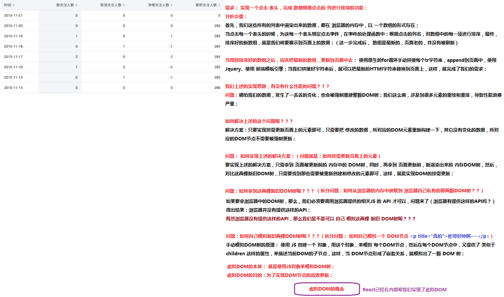
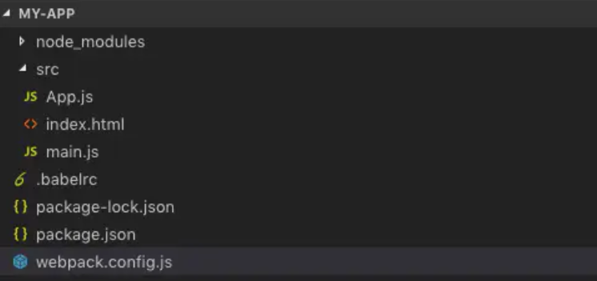

### React
<!-- TOC -->
- [虚拟DOM](#虚拟DOM)
- [Diff算法](#Diff算法)
- [React项目的创建](#React项目的创建)
- [JSX语法](#JSX语法)
- [ React 中创建组件的方式](# React 中创建组件的方式)

  

#### 虚拟DOM（Virtual Document Object Model）
 + DOM的本质是什么：就是用JS表示的UI元素（数据结构?）
 + DOM和虚拟DOM的区别：
   - DOM是由浏览器中的JS提供功能，所以我们只能人为的使用 浏览器提供的固定的API来操作DOM对象；
   - 虚拟DOM：并不是由浏览器提供的，而是我们程序员手动模拟实现的，类似于浏览器中的DOM，但是有着本质的区别；
 - 为什么要实现虚拟DOM？

   直接操作DOM会存在性能问题。

 - 什么是React中的虚拟DOM？

   

 - 虚拟DOM的目的：为了实现DOM节点的高效更新。

 - React 中虚拟DOM的概念


#### Diff算法
 - tree diff:新旧DOM树，逐层对比的方式，就叫做 tree diff,每当我们从前到后，把所有层的节点对比完后，必然能够找到那些 需要被更新的元素；
 - component diff：在对比每一层的时候，组件之间的对比，叫做 component diff;当对比组件的时候，如果两个组件的类型相同，则暂时认为这个组件不需要被更新，如果组件的类型不同，则立即将旧组件移除，新建一个组件，替换到被移除的位置；
 - element diff:在组件中，每个元素之间也要进行对比，那么，元素级别的对比，叫做 element diff；
 - key：key这个属性，可以把 页面上的 DOM节点 和 虚拟DOM中的对象，做一层关联关系；


#### React项目的创建
* 使用webpack、babel、react来创建React项目

1.  初始化项目
```javascript
> mkdir my-app
> cd my-app
> mkdir src
> npm init -y  --  使用npm命令初始化项目
```

2. 安装webpack
```javascript
> npm install webpack webpack-cli --save-dev

注意： 在这里简单介绍一下npm install命令的参数 --save-dev 和 --save的区别，一般来说使用--save-dev参数安装的npm包在最终打包的时候不会被包括到源码里去，所以类似bebel和webpack这种进行项目工程构建或者代码编译的库应该用--save-dev来安装，而--save则是安装代码运行必须的库，比如react等。
```
3. 安装Babel
``` javascript
 > npm install @babel/core babel-loader @babel/preset-env @babel/preset-react --save-dev
 
进行前端工程化的时候大多数前端工程师都会用到babel,最开始的babel是用来把es6的代码编译成es5的代码，让前端开发者在使用新的特性的同时不必考虑浏览器兼容问题。虽然现在的主流浏览器已经支持大部分的es6的新特性，但是因为JavaScript每年都会有一些新的特性被提出，而浏览器不一定能在特性推出后及时实现，或者是有一些还在实验中的语法。使用来babel后就可以忽略这些问题，可以放心使用新的JavaScript语法，甚至是实验性的语法。

接下来我们会安装这几个包：
@babel/core
@babel/preset-env
@babel/preset-react
babel-loader

@babel/core是babel的核心库，必须安装，
@babel/preset-env帮助我们把es6的语法编译成es5的语法，@babel/preset-react则是帮我们识别JSX语法，
babel-loader则是帮我们把不同的文件转化成我们想要的格式输出，或者说就是将我们的经过babel处理后的代码进行输出成浏览器可以识别的文件。

在安装成功后必须进行babel的配置，在根目录my-app建立.babelrc文件，然后写入以下配置:
{
  "presets": ["@babel/preset-env", "@babel/preset-react"]
}
```

然后我们需要做一些webpack的配置，在根目录my-app建立webpack.config.js文件，然后写入以下配置:
``` javascript
const path = require('path')
const HtmlWebpackPlugin = require('html-webpack-plugin')

module.exports = {
    entry:"./src/main.js",
    output: {
        filename: "bundle.js",
        path: path.resolve(__dirname,'dist')
    },
    module:{
        rules:[
            {
                test: /\.js$/,
                exclude: /node_modules/,
                use: {
                  loader: "babel-loader"
                }
            }
        ]
    },
    plugins: [
        new HtmlWebpackPlugin({
            template: path.join(__dirname, './src/index.html'),
            filename: 'index.html'
          })
      ]
}

```
在babel配置完之后，我们需要在./src目录下新建三个文件index.html、main.js、App.js,此时我们的项目的所有文件都创建完毕，项目结构应该如下所示：

2. **编写React代码**
配置完成后我们开始写react代码，首先在index.html文件中写入以下代码(在一个基本.html页面中加一个id是app的div)
``` html
<!DOCTYPE html>
<html lang="en">
<head>
  <meta charset="UTF-8">
  <meta name="viewport" content="width=device-width, initial-scale=1.0">
  <meta http-equiv="X-UA-Compatible" content="ie=edge">
  <title>React</title>
</head>
<body>
  <div id="app"></div>
</body>
</html>

```

  在写react代码前需要安装react和react-dom:

``` javascript
> npm install react react-dom --save
// react 这个包，是专门用来创建React组件、组件生命周期等这些东西的；
// react-dom 里面主要封装了和 DOM 操作相关的包，比如，要把 组件渲染到页面上

```

  在App.js文件中创建一个组件并导出:

``` javascript
import React from 'react'

export default class App extends React.Component{

    render(){
        return <div>
            <h1>Hello Word</h1>
        </div>
    }
}

```

在main.js中将组件导入并渲染:

``` javascript
import React from 'react'
import ReactDom from 'react-dom'
import App from './App.js'
//  使用 ReactDOM 把元素渲染到页面指定的容器中
// ReactDOM.render() 方法的第二个参数，和vue不一样，不接受 "#app" 这样的字符串，而是需要传递一个 原生的 DOM 对象
ReactDom.render(<App></App>,document.getElementById("app"))

```

* 运行项目

所有的代码已经完毕，在运行前我们还要安装webpack-dev-server用来启动一个本地服务器来浏览我们的项目并且可以实现保存自动刷新。

```shell
> npm install webpack-dev-server --save-dev
```

然后在根目录的package.json中写一个脚本:

```javascript
"scripts": {
    "start": "webpack-dev-server --open --mode development"
}
```

最后运行npm run start就可以在浏览器中看到Hello World了:

``` shell
> npm run start
```

#### JSX语法

1. 如要要使用 JSX 语法，必须先运行 `cnpm i babel-preset-react -D`，然后再 `.babelrc` 中添加 语法配置；
2. JSX语法的本质：还是以 React.createElement 的形式来实现的，并没有直接把 用户写的 HTML代码，渲染到页面上；
3. 如果要在 JSX 语法内部，书写 JS 代码了，那么，所有的JS代码，必须写到 {} 内部；
4. 当 编译引擎，在编译JSX代码的时候，如果遇到了`<`那么就把它当作 HTML代码去编译，如果遇到了 `{}` 就把 花括号内部的代码当作 普通JS代码去编译；
5. 在{}内部，可以写任何符合JS规范的代码；
6. 在JSX中，如果要为元素添加`class`属性了，那么，必须写成`className`，因为 `class`在ES6中是一个关键字；和`class`类似，label标签的 `for` 属性需要替换为 `htmlFor`.
7. 在JSX创建DOM的时候，所有的节点，必须有唯一的根元素进行包裹；
8. 如果要写注释了，注释必须放到 {} 内部


####  React 中创建组件的方式

* 第一种基本组件的创建方式
 ``` javascript
// 在React中，构造函数，就是一个最基本的组件
// 如果想要把组件放到页面中，可以把 构造函数的名称，当作 组件的名称，以 HTML标签形式引入页面中即可
// 注意：React在解析所有的标签的时候，是以标签的首字母来区分的，如果标签的首字母是小写，那么就按照 普通的 HTML 标签来解析，如果 首字母是大写，则按照 组件的形式去解析渲染
// 结论：组件的首字母必须是大写
function Hello(props) {
  // 在组件中，如果想要使用外部传递过来的数据，必须，显示的在 构造函数参数列表中，定义 props 属性来接收；
  // 通过 props 得到的任何数据都是只读的，不能从新赋值
  // props.name = '000'
  return <div>
    <h1>这是在Hello组件中定义的元素 --- {props.name}</h1>
  </div>
}
 ```


* 第二种基于class关键字创建组件

  ``` html
  import React from 'react'
  // 使用 class 创建的类，通过 extends 关键字，继承了 React.Component 之后，这个类，就是一个组件的模板了
  // 如果想要引用这个组件，可以把 类的名称， 以标签形式，导入到 JSX 中使用
  export default class Hello2 extends React.Component {
  constructor(props) {
    // 注意： 如果使用 extends 实现了继承，那么在 constructor 的第一行，一定要显示调用一下 super()
    super(props)
    // 在 constructor 中，如果想要访问 props 属性，不能直接使用 this.props， 而是需要在 constructor 的构造器参数列表中，显示的定义 props 参数来接收，才能正常使用；
    // console.log(props)
  
    // 注意： 这是固定写法，this.state 表示 当前组件实例的私有数据对象，就好比 vue 中，组件实例身上的 data(){ return {} } 函数
    // 如果想要使用 组件中 state 上的数据，直接通过 this.state.*** 来访问即可
    this.state = {
      msg: '这是 Hello2 组件的私有msg数据',
      info: '瓦塔西***'
    }
  }
  // 保存信息1： No `render` method found on the returned component instance: you may have forgotten to define `render`.
  // 通过分析以上报错，发现，提示我们说，在 class 实现的组件内部，必须定义一个 render 函数
  render() {
    // 报错信息2： Nothing was returned from render. This usually means a return statement is missing. Or, to render nothing, return null.
    // 通过分析以上报错，发现，在 render 函数中，还必须 return 一个东西，如果没有什么需要被return 的，则需要 return null
  
    // 虽然在 React dev tools 中，并没有显示说 class 组件中的 props 是只读的，但是，经过测试得知，其实 只要是 组件的 props，都是只读的；
    // this.props.address = '123'
    
    // console.log(this.props)
  
    return <div>
      <h1>这是 使用 class 类创建的组件</h1>
      <h3>外界传递过来的数据是： {this.props.address} --- {this.props.info}</h3>
      <h5>{this.state.msg}</h5>
    
      {/* 1.1 在React中，如果想要为元素绑定事件，不能使用 网页中 传统的 onclick 事件，而是需要 使用 React 提供的  onClick */}
      {/* 1.2 也就是说：React中，提供的事件绑定机制，使用的 都是驼峰命名，同时，基本上，传统的 JS 事件，都被 React 重新定义了一下，改成了 驼峰命名 onMouseMove  */}
      {/* 2.1 在 React 提供的事件绑定机制中，事件的处理函数，必须直接给定一个 function，而不是给定一个 function 的名称 */}
      {/* 2.2 在为 React 事件绑定 处理函数的时候，需要通过 this.函数名， 来把 函数的引用交给 事件 */}
      <input type="button" value="修改 msg" id="btnChangeMsg" onClick={this.changeMsg} />
    
      <br />
    
    </div>
  }
  
  changeMsg = () => {
    // console.log('ok')
    // 注意： 这里不是传统网页，所以 React 已经帮我们规定死了，在 方法中，默认this 指向 undefined，并不是指向方法的调用者
    // console.log(this)
  
    // 直接使用 this.state.msg = '123' 为 state 上的数据重新赋值，可以修改 state 中的数据值，但是，页面不会被更新；
    // 所以这种方式，React 不推荐，以后尽量少用；
    // this.state.msg = '123'
    
    // 如果要为 this.state 上的数据重新赋值，那么，React 推荐使用 this.setState({配置对象}) 来重新为 state 赋值
    // 注意： this.setState 方法，只会重新覆盖那些 显示定义的属性值，如果没有提供最全的属性，则没有提供的属性值，不会被覆盖；
    /* this.setState({
      msg: '123'
    }) */
    
    // this.setState 方法，也支持传递一个 function，如果传递的是 function，则在 function 内部，必须return 一个 对象；
    // 在 function 的参数中，支持传递两个参数，其中，第一个参数是 prevState，表示为修改之前的 老的 state 数据
    // 第二个参数，是 外界传递给当前组件的 props 数据
    this.setState(function (prevState, props) {
      // console.log(props)
      return {
        msg: '123'
      }
    }, function () {
      // 由于 this.setState 是异步执行的，所以，如果想要立即拿到最新的修改结果，最保险的方式， 在回调函数中去操作最新的数据
      console.log(this.state.msg)
    })
    // 经过测试发现， this.setState 在调用的时候，内部是异步执行的，所以，当立即调用完 this.setState 后，输出 state 值可能是旧的
    // console.log(this.state.msg)
  }
  }
  ```


* 两种创建组件方式的对比

  1. 用构造函数创建出来的组件：专业的名字叫做“无状态组件”
  2. 用class关键字创建出来的组件：专业的名字叫做“有状态组件”

  > 用构造函数创建出来的组件，和用class创建出来的组件，这两种不同的组件之间的**本质区别就是**：有无state属性！！！
  > 有状态组件和无状态组件之间的本质区别就是：有无state属性！

​    
