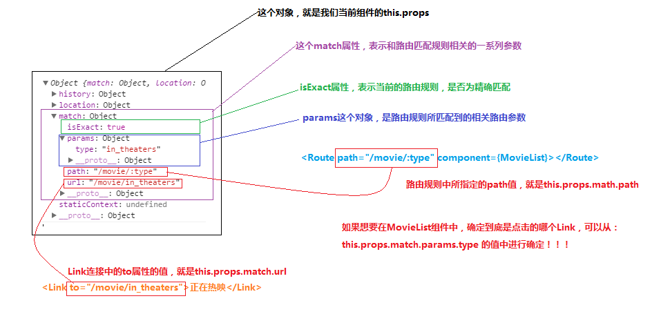

### React路由

[toc]

#### 使用react-router-dom实现路由跳转

+ HashRouter：是一个路由的跟容器，一个应用程序中，一般只需要唯一的一个HashRouter容器即可！将来，所有的Route和Link都要在HashRouter中进行使用

 - 注意：HashRouter中，只能有唯一的一个子元素

+ Link：是相当于超链接一般的存在；点击Link，跳转到相应的路由页面！负责进行路由地址的切换！

+ Route：是路由匹配规则，当路由地址发生切换的时候，就会来匹配这些定义好的Route规则，如果有能匹配到的路由规则，那么，就会展示当前路由规则所对应的页面！

+ Route：除了是一个匹配规则之外，还是一个占位符，将来，此Route所匹配到的组件页面，将会展示到Route所在的这个位置！
```javascript
// 其中path指定了路由匹配规则，component指定了当前规则所对应的组件
<Route path="" component={}></Route>
```

+ 注意：react-router中的路由匹配，是进行模糊匹配的！可以通过`Route`身上的`exact`属性，来表示当前的`Route`是进行精确匹配的
+ 可以使用`Redirect`实现路由重定向

```javascript
    // 导入路由组件
    import {Route, Link, Redirect} from 'react-router-dom'
    <Redirect to="/movie/in_theaters"></Redirect>
```


## this.prop和Route的关系【重要】

