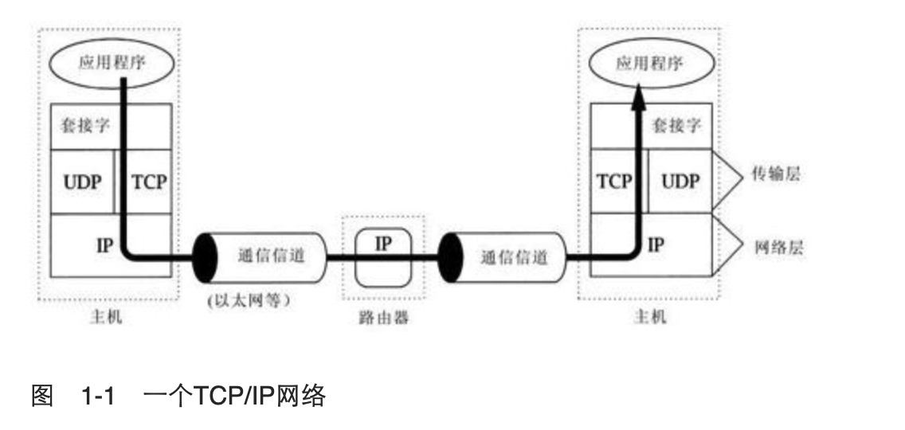
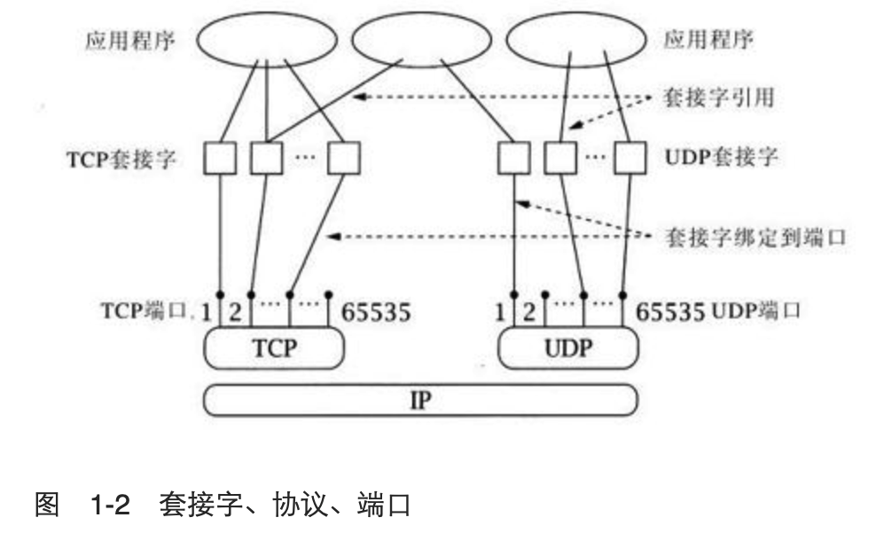

### 计算机网络，分组报文和协议

​        **协议(protocol)**相当于是相互通信的程序间达成的一种约定，它规定了分组报文的交 换方式和它们包含的意义。一组协议规定了分组报文的结构(例如报文中的哪一部分表明了 其目的地址)以及怎样对报文中所包含的信息进行解析。**设计一组协议，通常是为了在一定 约束条件下解决某一特定的问题**。比如，超文本传输协议(HTTP，HyperText Transfer Protocol)是为了解决在服务器间传递超文本对象的问题，这些超文本对象在服务器中创建 和存储，并由 Web 浏览器进行可视化，以使其对用户有用。即时消息协议是为了使两个或 更多用户间能够交换简短的文本信息。

​         要实现一个有用的网络，必须解决大量各种各样的问题。为了使这些问题可管理和模块 化，人们设计了不同的协议来解决不同类型的问题。**TCP/IP 协议就是这样一组的解决方案， 有时也被称为协议族(protocol suite)**。它刚好是互联网所使用的协议，不过也能用在独立 的专用网络中。本书以后所提到的网络(network)，都是指任何使用了 TCP/IP 协议族的网 络。TCP/IP 协议族主要协议有 **IP 协议(互联网协议，Internet Protocol)，TCP 协议(传 输控制协议，Transmission Control Protocol)和 UDP 协议(用户数据报协议，User Datagram Protocol)。**

​         图1-1展示了主机和路由器中的通信协议、应用程序和套接字API之间的关系，同时也展示了数据流从一个应用程序到另一个应用程序的过程（使用TCP协议）。标记为TCP、UDP和IP的方框分别代表了这些协议的实现，它们通常驻留在主机的操作系统中。**应用程序通过套接字API对UDP协议和TCP协议所提供的服务进行访问。**箭头描述了数据流从一个应用程序，经过TCP协议层和IP协议层，通过网络，再经过IP协议层和TCP协议层传输到另一端的应用程序。

​        在TCP/IP协议族中，底层由基础的通信信道构成，如以太网或调制解调器拨号连接。这些信道由网络层（network layer）使用，而网络层则完成将分组报文传输到它们的目的地址的工作（也就是路由器的功能）。TCP/IP协议族中属于网络层的唯一协议是IP协议，它使两个主机间的一系列通信信道和路由器看起来像是单独一条主机到主机的信道。

​       **IP协议层之上称为传输层（transport layer）。它提供了两种可选择的协议：TCP协议和UDP协议。**这两种协议都建立在IP层所提供的服务基础上，但根据应用程序协议（application protocol）的不同需求，它们使用了不同的方法来实现不同方式的传输。**TCP协议和UDP协议有一个共同的功能，即寻址。**回顾一下，**IP协议只是将分组报文分发到了不同的主机**，很明显，还需要更细粒度的寻址将报文发送到主机中指定的应用程序，因为同一主机上可能有多个应用程序在使用网络。TCP协议和UDP协议使用的地址叫做端口号（port number），都是用来区分同一主机中的不同应用程序的。TCP协议和UDP协议也称为端到端传输协议（end-to-end transport protocol），因为它们将数据从一个应用程序传输到另一个应用程序，而IP协议只是将数据从一个主机传输到另一主机。

​        TCP协议能够检测和恢复IP层提供的主机到主机的信道中可能发生的报文丢失、重复及其他错误。TCP协议提供了一个可信赖的字节流（reliable byte-stream）信道，这样应用程序就不需要再处理上述的问题。TCP协议是一种面向连接（connection-oriented）的协议：在使用它进行通信之前，两个应用程序之间首先要建立一个TCP连接，这涉及相互通信的两台电脑的TCP部件间完成的握手消息（handshake message）的交换。使用TCP协议在很多方面都与文件的输入输出（Input/Output，I/O）相似。实际上，由一个程序写入的文件再由另一个程序读取就是一个TCP连接的适当模型。另一方面，UDP协议并不尝试对IP层产生的错误进行修复，它仅仅简单地扩展了IP协议“尽力而为”的数据报服务，使它能够在应用程序之间工作，而不是在主机之间工作。因此，使用了UDP协议的应用程序必须为处理报文丢失、顺序混乱等问题做好准备。

### 关于地址

​         寄信的时候，要在表格中填上邮政服务能够理解的收信人的地址。在给别人打电话时，必须拨电话号码。同样，一个程序要与另一个程序通信，就要给网络提供足够的信息，使其能够找到另一个程序。在**TCP/IP协议中，有两部分信息用来定位一个指定的程序：互联网地址（Internet address）和端口号（port number）**。其中**互联网地址由IP协议使用，而附加的端口地址信息由传输协议（TCP或IP协议）对其进行解析。**

​        **互联网地址**由二进制数字组成，有两种型式，分别对应了两个版本的标准互联网协议。现在最常用的版本是版本4，即**IPv4**，另一个版本是刚开始开发的版本6，即**IPv6**。IPv4[[1\]](https://www.momo.cm/read/0035/index_split_006.html#filepos47111)的地址长32位，只能区分大约40亿个独立地址，对于如今的互联网来说，这是不够大的。（也许看起来很多，但由于地址的分配方式的原因，有很多都被浪费了）出于这个原因引入了IPv6[[2\]](https://www.momo.cm/read/0035/index_split_006.html#filepos47319)，它的地址有128位长。

​        为了便于人们使用互联网地址（相对于程序内部的表示），两个版本的IP协议有不同的表示方法。IPv4地址被表示为一组4个十进制数，每两个数字之间由圆点隔开（如：10.1.2.3），这种表示方法叫做**点分形式**（dotted-quad）。点分形式字符串中的4个数字代表了互联网地址的4个字节，也就是说，每个数字的范围是0～255。

​        另一方面，IPv6地址的16个字节由几组16进制的数字表示，这些16进制数之间由分号隔开（如：2000：fdb8：0000：0000：0001：00ab：853c：39a1）。每组数字分别代表了地址中的两个字节，并且每组开头的0可以省略，因此前面的例子中，第5组和第6组数字可以缩写为：1：ab：。甚至，只包含0的连续组可以全部省略（但在一个地址中只能这样做一次）。因此，该例子的完整地址可以表示为2000：fdb8：1：00ab：853c：39a1。

​        从技术角度来讲，每个**互联网地址代表了一台主机与底层的通信信道的连接**，换句话说，也就是一个网络接口（network interface）。主机可以有多个接口，这并不少见，例如一台主机同时连接了有线以太网（Ethernet）和无线网（WiFi）。由于每个这样的连接都属于唯一的一台主机，所以只要它连接到网络，一个互联网地址就能定位这条主机。但是反过来，一台主机并不对应一个互联网地址。因为每台主机可以有多个接口，每个接口又可以有多个地址。（实际上一个接口可以同时拥有IPv4地址和IPv6地址）。

​          **TCP或UDP协议中的端口号总与一个互联网地址相关联**。回到前面我们作类比的例子，一个端口号就相当于指定街道上一栋大楼的某个房间号。邮政服务通过街道地址把信分发到一个邮箱，再由清空邮箱的人把这封信递送到这栋楼的正确房间中。或者考虑一个公司的内部电话系统：要与这个公司中的某个人通话，首先要拨打该公司的总机电话号码连接到其内部电话系统，然后再拨打你要找的那个人的分机号码。在上面的例子中，互联网地址就相对于街道地址或公司的总机电话号码，端口号就相当于房间号或分机号码。**端口号是一组16位的无符号二进制数，每个端口号的范围是1～65535（0被保留）。**

​         每个版本的IP协议都定义了一些特殊用途的地址。其中值得注意的一个是回环地址（loopback address），该地址总是被分配个一个特殊的回环接口（loopback interface）。回环接口是一种虚拟设备，它的功能只是简单地将发送给它的报文直接回发给发送者。回环接口在测试中非常有用，因为发送给这个地址的报文能够立即返回到目标地址。而且每台主机上都有回环接口，即使当这台计算机没有其他接口（也就是说没有连接到网络），回环接口也能使用。**IPv4的回环地址是127.0.0.1，IPv6的回环地址是0：0：0：0：0：0：0：1**。

​          IPv4地址中的另一种特殊用途的**保留地址**包括那些“私有用途”的地址。它们包括IPv4中所有以**10或192.168开头**的地址，以及第一个数是172，第二个数在16～31的地址。（在IPv6中没有相应的这类地址）这类地址最初是为了在私有网络中使用而设计的，不属于公共互联网的一部分。现在这类地址通常被用在家庭或小型办公室中，这些地方通过NAT（Network Address Translation，网络地址转换）设备连接到互联网。NAT设备的功能就像一个路由器，转发分组报文时将转换（重写）报文中的地址和端口。更准确地说，它将一个接口中报文的私有地址端口对（private address，port pairs）映射成另一个接口中的公有地址端口对（public address，port pairs）。这就使一小组主机（如家庭网络）能够有效地共享同一个IP地址。重要的是这些内部地址不能从公共互联网访问。如果你在拥有私有类型地址的计算机上试验本书的例子，并试图与另一台没有这类地址的主机进行通信，通常只有这台拥有私有类型地址的主机发起的通信才能成功。

相关的类型的地址包括本地链接（link-local），或称为“自动配置”地址。IPv4中，这类地址由169.254开头，在IPv6中，前16位由FE8开头的地址是本地链接地址。这类地址只能用来在连接到同一网络的主机之间进行通信，路由器不会转发这类地址的信息。

最后，另一类地址由多播（multicast）地址组成。普通的IP地址（有时也称为“单播”地址）只与唯一一个目的地址相关联，而多播地址可能与任意数量的目的地址关联。我们将在第4章中简要地对多播技术作进一步介绍。IPv4中的多播地址在点分格式中，第一个数字在224～239之间。IPv6中，多播地址由FF开始。

### 关于名字

可以用名字来指代一个主机，例如：host.example.com。

名字解析服：

* 域名系统（Domain Name System，DNS）
* 本地配置数据库(host文件？)

### 客户端和服务器

​       在前面的邮政和电话系统例子中，每次通信都是由发信方或打电话者发起，而另一方则通过发回反馈信或接听电话来对通信的发起者作出响应。互联网通信也与这个过程类似。客户端（client）和服务器（server）这两个术语代表了两种角色：客户端是通信的发起者，而服务器程序则被动等待客户端发起通信，并对其作出响应。客户端与服务器组成了应用程序（application）。客户端和服务器这两个术语对典型的情况作出了描述，服务器具有一定的特殊能力，如提供数据库服务，并使任何客户端能够与之通信。

​       一个程序是作为客户端还是服务器，决定了它在与其对等端（peer）建立通信时使用的套接字API的形式（客户端的对等端是服务器，反之亦然）。更进一步来说，客户端与服务器端的区别非常重要，因为客户端首先需要知道服务器的地址和端口号，反之则不需要。如果有必要，服务器可以使用套接字API，从收到的第一个客户端通信消息中获取其地址信息。这与打电话非常相似：被呼叫者不需要知道拨电话者的电话号码。就像打电话一样，只要通信连接建立成功，服务器和客户端之间就没有区别了。

​       客户端如何才能找到服务器的地址和端口号呢？通常情况，客户端知道服务器的名字，例如使用URL（Universal Resource Locator，统一资源定位符）如http：//www.mkp.com，再通过名字解析服务获取其相应的互联网地址。

​       获取服务器的端口号则是另一种情况。从原理上来讲，服务器可以使用任何端口号，但客户端必须能够获知这些端口号。在互联网上，一些常用的端口号被约定赋给了某些应用程序。例如，端口号21被FTP（File Transfer Protocol，文件传输协议）使用。当你运行FTP客户端应用程序时，它将默认通过这个端口号连接服务器。互联网的端口号授权机构维护了一个包含所有已约定使用的端口号列表（见http：//www.iana.org/assignments/port-numbers）

### 什么是套接字

​        **socket（套接字）是一种抽象层，应用程序通过它来发送和接收数据**，就像应用程序打开一个文件句柄，将数据读写到稳定的存储器上一样。使用**socket可以将应用程序添加到网络中，并与处于同一个网络中的其他应用程序进行通信。**一台计算机上的应用程序向socket写入的信息能够被另一台计算机上的另一个应用程序读取，反之亦然。

​         不同类型的socket与不同类型的底层协议族以及同一协议族中的不同协议栈相关联，本书只涵盖了TCP/IP协议族的内容。现在TCP/IP协议族中的主要socket类型为流套接字（stream socket）和数据报套接字（datagram socket）。**流套接字将TCP作为其端对端协议**（底层使用IP协议），提供了一个可信赖的字节流服务。一个TCP/IP流套接字代表了TCP连接的一端。**数据报套接字使用UDP协议**（底层同样使用IP协议），提供了一个“尽力而为”（best-effort）的数据报服务，应用程序可以通过它发送最长65 500字节的个人信息。当然，其他协议族也支持流套接字和数据报套接字，但本书只对TCP流套接字和UDP数据报套接字进行讨论。一个TCP/IP套接字由一个互联网地址，一个端对端协议（TCP或UDP协议）以及一个端口号唯一确定。随着进一步学习，你将了解到把一个套接字绑定到一个互联网地址上的多种方法。

图1-2描述了一个主机中，应用程序、套接字抽象层、协议、端口号之间的逻辑关系。值得注意的是一个套接字抽象层可以被多个应用程序引用。每个使用了特定套接字的程序都可以通过那个套接字进行通信。前面已提到，每个端口都标识了一台主机上的一个应用程序。实际上，一个端口确定了一台主机上的一个套接字。从图1-2中我们可以看到，主机中的多个程序可以同时访问同一个套接字。在实际应用中，访问相同套接字的不同程序通常都属于同一个应用（例如，Web服务程序的多个副本），但从理论上讲，它们是可以属于不同应用的。

### 资料

* [Java TCP/IP Socket编程(原书第2版)](https://www.momo.cm/books/0035)

  

