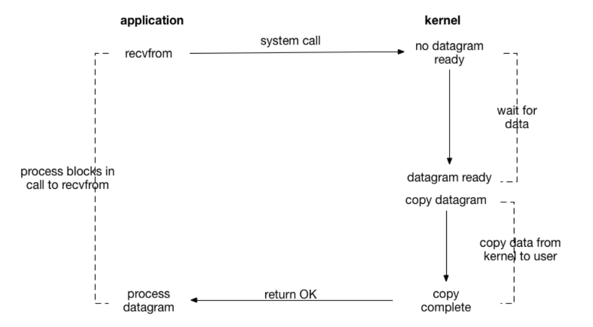
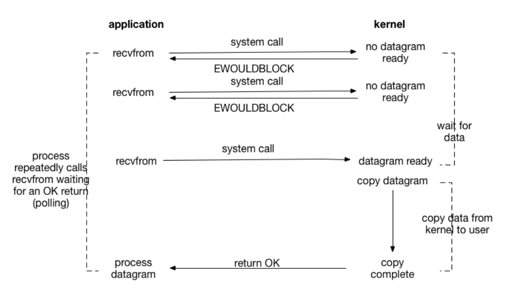
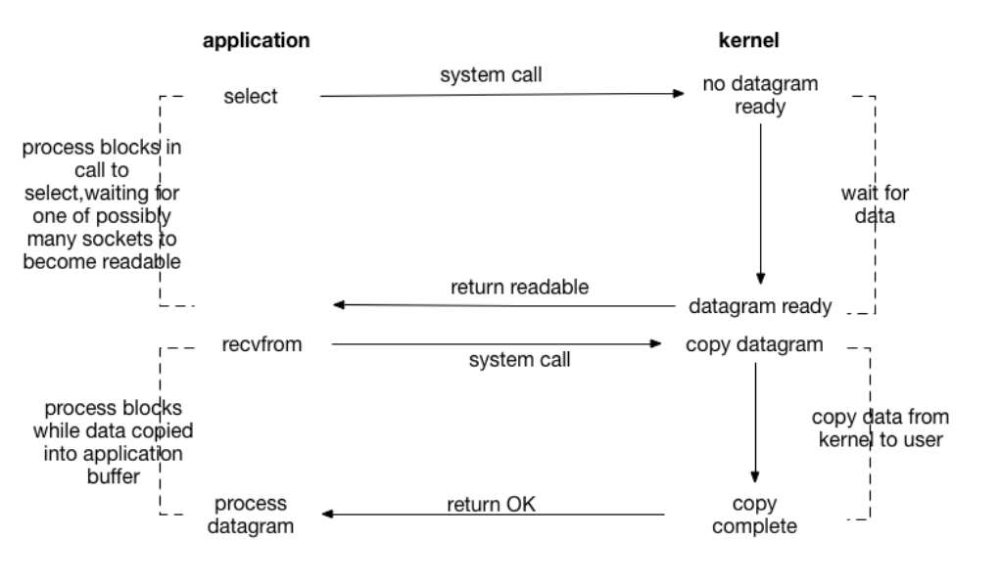
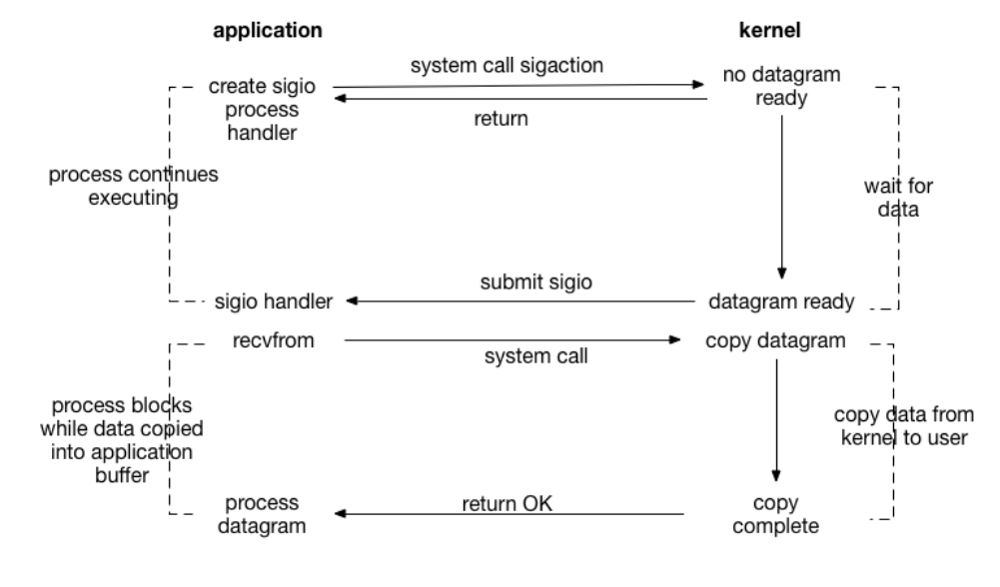
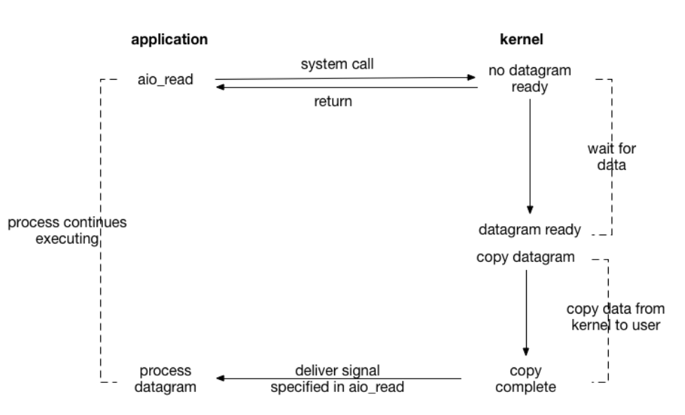

## IO复用

关键词: 同步 异步 阻塞 非阻塞

一个文件IO的读过程: 文件数据从磁盘--->内核缓冲区--->用户内存

### 同步阻塞

### 同步非阻塞

### IO复用(多路IO就绪通知)

IO复用的主要实现方式有: select poll 和 epoll

水平触发:

边缘触发:

### 信号驱动

### 异步非阻塞

## 网络编程模型

1. BIO
2. NIO
3. AIO

----

1. Master进程
2. woker进程
3. cache manager进程

---

sendfile

---

worker_processes

events{  }

http{  

​	include 

​	default_type

​	sendfile

​	...

​	server{ 

​		localtion

​	}

}

Nagle算法:

nginx

​	server{} :虚拟主机

​	location{} :

​	*location /URI {}

​	*location =/URI{}

location [ = | ~ | ~* | ^~ ] uri { ... }

location  URI {}:

​	对当前路径及子路径下的所有对象都生效

location  = URI{}:

​	精确匹配指定的路径,不包括子路径,因此,只对当前资源生效

location ~ URI{}:

location ~* URI{} :

​	模式匹配URI,此处的URI可使用正则表达式,~区分字符大小写,~*不区分字符大小写

location ^~ URI {}:

​	不使用正则表达式

访问顺序:

---

Nginx :

​	mmap

​	event-driven

​		一个进程响应多个请求:单线程进程

公共缓存:

xcache:

mencache:

---

参考资料:

http://www.importnew.com/22019.html

https://my.oschina.net/u/4455409/blog/4867932