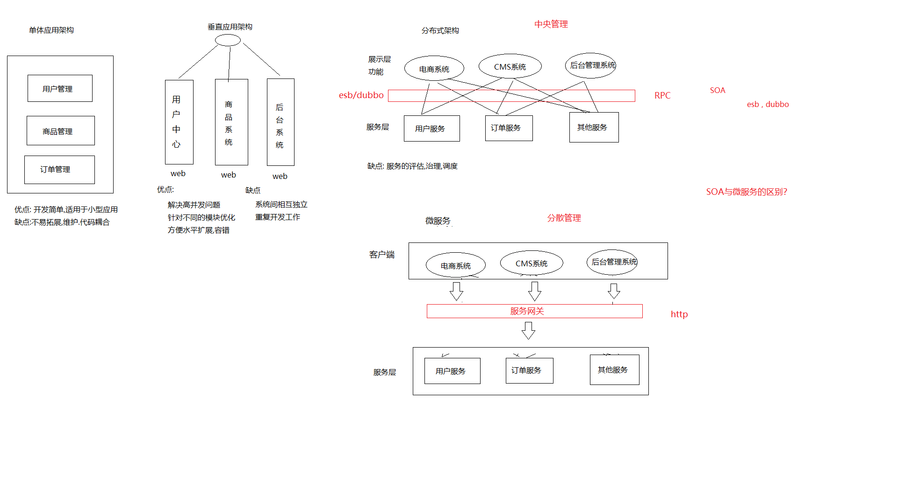
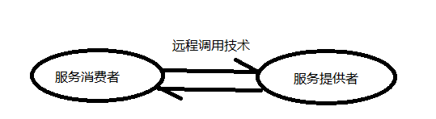
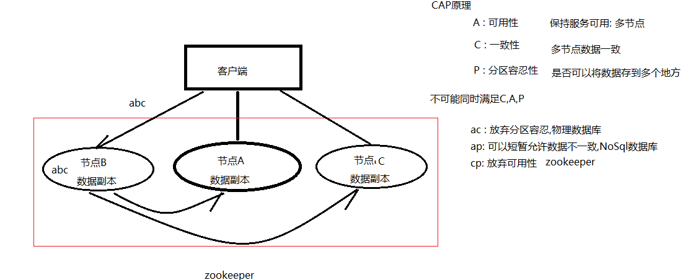
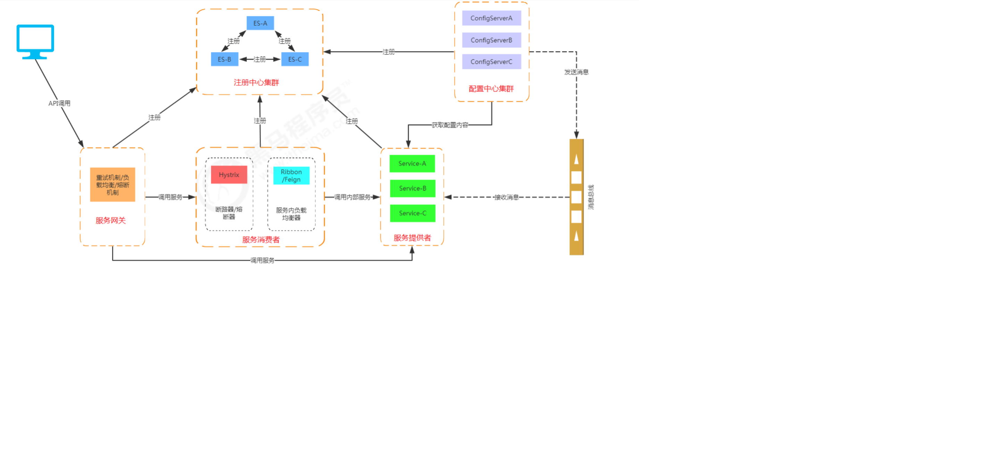
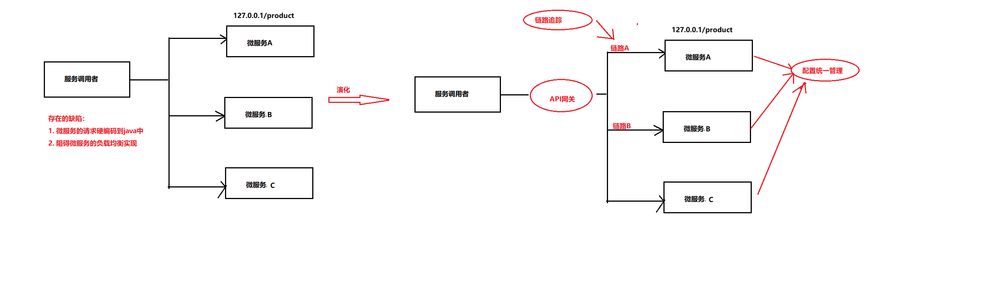
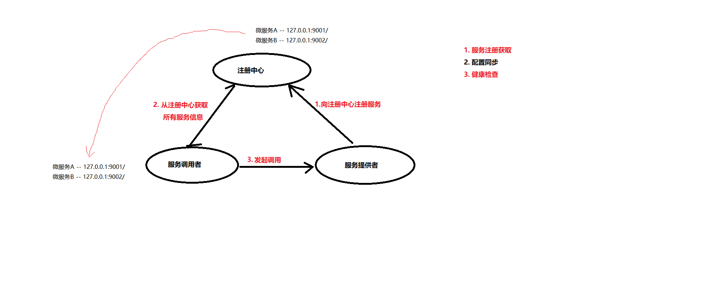
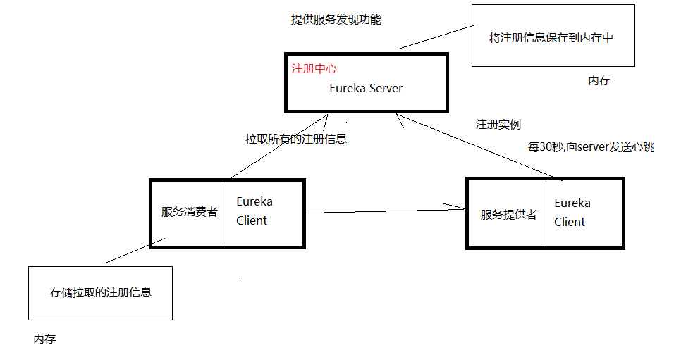
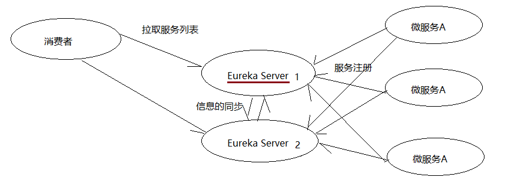
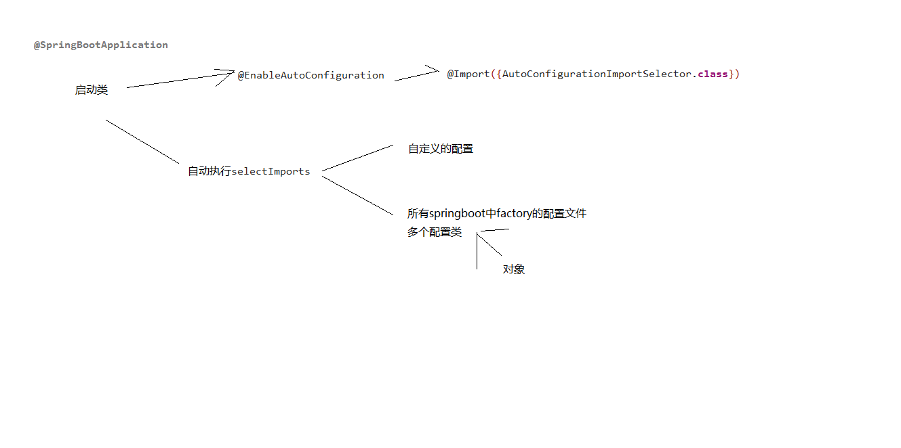
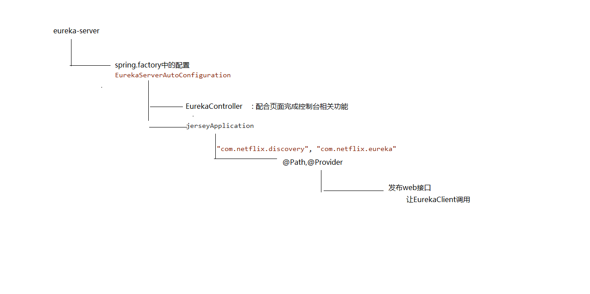

### 微服务

[toc]

#### 系统架构演变

### 核心概念

#### 远程调用技术

流行的远程调用技术：

#### RPC (主要使用的是TCP协议)

#### RESTful  (HTTP) 

REST，即Representational State Transfer的缩写，如果一个架构符合REST原则，就称它为RESTful架 构。

#### CAP

### SpringCloud 概述

Spring Cloud是一系列框架的有序集合。如服务发现注册、配置中心、消息总线、负载均衡、断路器、数据监控等。

#### 相关概念

* 服务注册：服务实例将自身服务信息注册到注册中心。这部分服务信息包括服务所在主机IP和提供服务 的Port，以及暴露服务自身状态以及访问协议等信息。

*  服务发现：服务实例请求注册中心获取所依赖服务信息。服务实例通过注册中心，获取到注册到其中的 服务实例的信息，通过这些信息去请求它们提供的服务。

* 负载均衡： 是高可用网络基础架构的关键组件，通常用于将工作负载分布到多个服务器来提高网站、应 用、数据库或其他服务的性能和可靠性。

* 熔断： 当下游服务因访问压 力过大而响应变慢或失败，上游服务为了保护系统整体的可用性，可以暂时切断对下游服务的调用。这 种牺牲局部，保全整体的措施就叫做熔断。

* 链路追踪： 对一次请求涉及的多个 服务链路进行日志记录，性能监控即链路追踪。

*  API网关: 将所有API调用统一接入到API网关层，由网关层统一接入和输出。一个网关的基本 功能有：统一接入、安全防护、协议适配、流量管控、长短链接支持、容错能力。有了网关之后，各个 API服务提供团队可以专注于自己的的业务逻辑处理，而API网关更专注于安全、流量、路由等问题。

  

#### SpringCloud 核心组件

* **Spring Cloud Netflix组件**
|  组件名称    | 作用  |
|  ----  | ----  |
| Eureka   | 服务注册中心 |
| Ribbon  | 客户端负载均衡 |
| Feign  | 声明式服务调用 |
| Hystrix  | 客户端容错保护 |
| Zuul  | API服务网关 |

* **Spring Cloud Alibaba组件**
|  组件名称    | 作用  |
|  ----  | ----  |
| Nacos   | 服务注册中心 |
| Sentinel  | 客户端容错保护 |

* **Spring Cloud原生及其他组件**
|  组件名称    | 作用  |
|  ----  | ----  |
| Consul   | 服务注册中心 |
| Config  | 分布式配置中心 |
| Gateway  | API服务网关 |
| Sleuth/Zipkin  | 分布式链路追踪 |

* **SpringCloud 体系结构图**

  
#### RestTemplate 微服务间的调用
Spring框架提供的RestTemplate类可用于在应用中调用rest服务，它简化了与http服务的通信方式，统
一了RESTful的标准，封装了http链接， 我们只需要传入url及返回值类型即可。相较于之前常用的
HttpClient，RestTemplate是一种更优雅的调用RESTful服务的方式。

#### 微服务中的问题

1. 请求硬编码问题
2. 微服务负载均衡的问题
   ....

#### 微服务注册中心

  服务注册中心（下称注册中心）是微服务架构非常重要的一个组件，在微服务架构里主要起到了协调者 的一个作用。注册中心一般包含如下几个功能：
1. **服务发现**：
* 服务注册/反注册：保存服务提供者和服务调用者的信息
* 服务订阅/取消订阅：服务调用者订阅服务提供者的信息，最好有实时推送的功能
* 服务路由（可选）：具有筛选整合服务提供者的能力。
2. **服务配置**：
* 配置订阅：服务提供者和服务调用者订阅微服务相关的配置
* 配置下发：主动将配置推送给服务提供者和服务调用者
3. **服务健康检测**
* 检测服务提供者的健康情况

#### Eureka

**组成**

1、**Eureka Server**
提供服务注册和发现
2、**Service Provider**
服务提供方，将自身服务注册到Eureka，从而使服务消费方能够找到
3、**Service Consumer**
服务消费方，从Eureka获取注册服务列表，从而能够消费服务

> 存在问题：  服务消费者把注册信息缓存到自己的内存中，可能存在数据不一致的情况。

#### Eureka 高可用

实战：

#### Eureka中存在的问题
1.  服务注册慢 
2.  服务节点剔除问题 （自我保护机制）
3.  监控页面显示ip  （显示注册的服务的IP）

#### Eurake 源码解析

* **Spring中的自动装载ImportSelector**

  

* **SpringBoot自动装载**

* **EnableEurekaServer相关源码**

  

###  Ribbon

